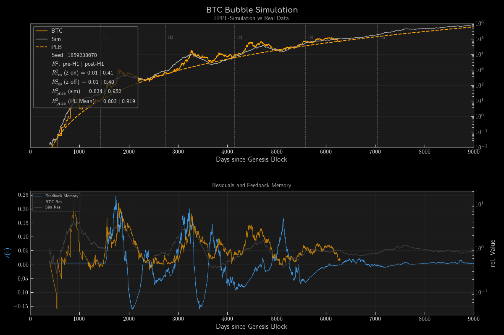
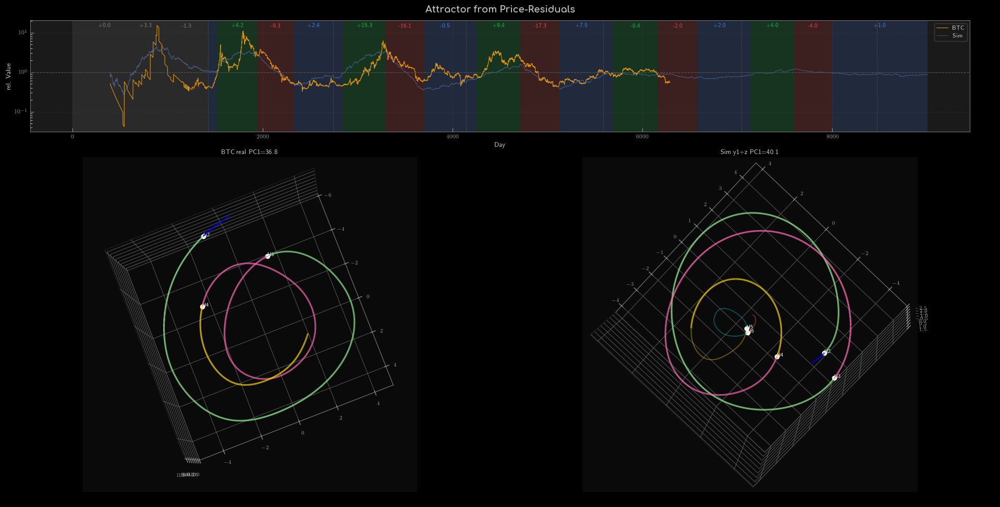

# LPPL-attractor

Bitcoin price residuals as a nonlinear LPPL oscillator, driven by a sign-OU process on the
local power-law exponent, with optional feedback memory `z`. Equations and parameters: **`DGL.pdf`**.

```
./lpplattr02.py --seed 28 --b-quarter        # reproducible run, noise scale b / 4
./lpplattr02.py --seed 28 --b-quarter --zero-z   # same run, z feedback off (Z_A = Z_B = Z_MIX = 0)
./lpplattr02.py --b-quarter --mu-data        # target exponent = 30-day mean of the measured exponent
./lpplattr02.py --mu-data --mu-until 5586    # measured exponent up to halving 4, phase table after
./lpplattr02.py --zero-sigma --zero-z        # deterministic path, z off
```

Example output of `./lpplattr02.py --b-quarter` (seed 1859238670, reproducible with `--seed 1859238670`):




Further options: `--b-half`, `--days N`, `-h`. Data: `ziel.csv` (BTC daily close, day since genesis).
Requires Python 3 with numpy, matplotlib, scipy.
